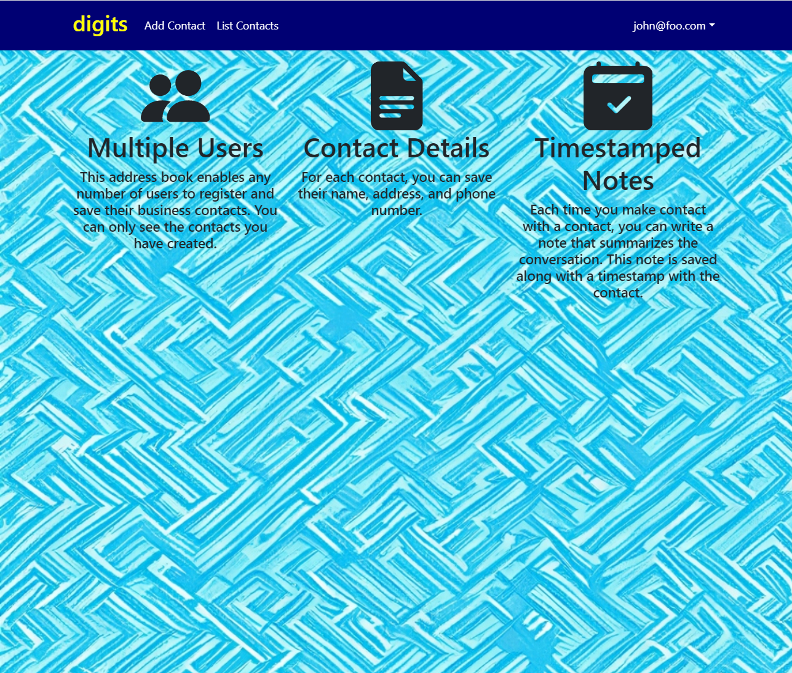

This is a simple Contact List management tool called "digits"

  * A standard directory layout using 'imports/' as recommended in the [Meteor Guide](https://guide.meteor.com/structure.html)
  * [Bootstrap 5 React](https://react-bootstrap.github.io/) for user interface.
  * [Uniforms](https://uniforms.tools/) for form development.
  * [alanning:roles](https://github.com/alanning/meteor-roles) to implement a special "Admin" user.
  * Authorization, authentication, and registration using built-in Meteor packages.
  * Initialization of users and data from a settings file.
  * Alerts regarding success or failure of DB updates using [Sweet Alert](https://sweetalert.js.org/).
  * Quality assurance using [ESLint](http://eslint.org) with packages to partially enforce the [Meteor Coding Standards](https://guide.meteor.com/code-style.html) and the [AirBnB Javascript Style Guide](https://github.com/airbnb/javascript).

The goal of this tool is provide routes and protected routes for contact list data.

## Installation

First, [install Meteor](https://www.meteor.com/install).

Second, go to [https://github.com/gahernan14/digits), and click the "Download file" button. Open the repository in your preferred editing program.

Third, go to your newly created repository, and click the "Clone or download" button to download your new GitHub repo to your local file system.  Using [GitHub Desktop](https://desktop.github.com/) is a great choice if you use MacOS or Windows.

Fourth, cd into the app/ directory of your local copy of the repo, and install third party libraries with:

```
$ meteor npm install
```

## Running the system

```
$ meteor npm run start
```
### Viewing the running app

If all goes well, the template application will appear at [http://localhost:3000](http://localhost:3000).  You can login using the credentials in [settings.development.json](https://github.com/ics-software-engineering/meteor-application-template-react/blob/main/config/settings.development.json), or else register a new account.

### ESLint

You can verify that the code obeys our coding standards by running ESLint over the code in the imports/ directory with:

```
meteor npm run lint
```

## Walkthrough

The following sections describe the major features of this template.

### Directory structure

The top-level directory structure is:

```
.github     # holds the GitHub Continuous Integration action and Issue template.
app/        # holds the Meteor application sources
config/     # holds configuration files, such as settings.development.json
doc/        # holds developer documentation, user guides, etc.
.gitignore  # don't commit IntelliJ project files, node_modules, and settings.production.json
```

This structure separates documentation files (such as screenshots) and configuration files (such as the settings files) from the actual Meteor application.

The app/ directory has this structure:

```
.deploy/
  .gitignore     # don't commit mup.js or settings.json
  mup.sample.js  # sample mup.js file used for deploying the application
  settings.sample.json # sample settings file
  
client/
  main.html      # The boilerplate HTML with a "root" div to be manipulated by React.
  main.js        # import startup files.

imports/
  api/           # Define collections
    stuff/       # The Stuffs collection definition
  startup/       # Define code to run when system starts up (client-only, server-only, both)
    client/
    server/
  ui/
    components/  # Contains page elements, some of which could appear on multiple pages.
    layouts/     # Contains top-level layout (<App> component).
    pages/       # Contains components for each page.

node_modules/    # managed by npm

public/          # static assets (like images) can go here.

server/
   main.js       # import the server-side js files.
   
tests/           # testcafe acceptance tests.
```

### Import conventions

This system adheres to the Meteor guideline of putting all application code in the imports/ directory, and using client/main.js and server/main.js to import the code appropriate for the client and server in an appropriate order.

### Application functionality

The application implements a simple CRUD application for managing "Stuff", which is a Mongo Collection consisting of a name (String), a quantity (Number), a condition (one of 'excellent', 'good', 'fair', or 'poor') and an owner.

By default, each user only sees the Stuff that they have created.  However, the settings file enables you to define default accounts.  If you define a user with the role "admin", then that user gets access to a special page which lists all the Stuff defined by all users.

#### Landing page

When you retrieve the app at http://localhost:3000, this is what should be displayed:


The next step is to use the Login menu to either Login to an existing account or register a new account.

#### Login page

Clicking on the Login link, then on the Sign In menu item displays this page:


#### Register page

Alternatively, clicking on the Login link, then on the Sign Up menu item displays this page:


#### Landing (after Login) page, non-Admin user

Once you log in (either to an existing account or by creating a new one), the navbar changes as follows:


### Quality Assurance

#### ESLint

The application includes a [.eslintrc](https://github.com/ics-software-engineering/meteor-application-template-react/blob/main/app/.eslintrc) file to define the coding style adhered to in this application. You can invoke ESLint from the command line as follows:

```
[~/meteor-application-template-react/app]-> meteor npm run lint

> meteor-application-template-react@ lint /Users/philipjohnson/meteor-application-template-react/app
> eslint --quiet ./imports
```

ESLint should run without generating any errors.

It's significantly easier to do development with ESLint integrated directly into your IDE (such as IntelliJ).
